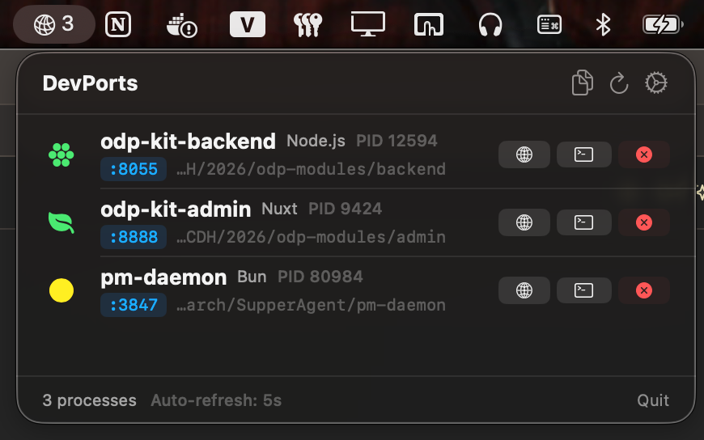

# DevPorts

Tiny macOS menu bar app for instantly seeing all local development servers and ports.

No more `lsof -iTCP -sTCP:LISTEN | grep node` and `kill -9 PID`. Just click the menu bar icon.



## Install

### Homebrew (recommended)

```bash
brew install --cask codihaus/tap/devports
```

### Quick install (curl)

```bash
curl -fsSL https://raw.githubusercontent.com/codihaus/devports/main/install.sh | bash
```

### Download

Grab the latest `.app.zip` from [Releases](https://github.com/codihaus/devports/releases), unzip, drag to Applications.

> First launch: macOS may block unsigned apps. Right-click the app → Open to bypass.

## Features

- **Project name detection** — reads `package.json`, `pyproject.toml`, `go.mod`, `composer.json`, or falls back to folder name
- **Framework detection** — Vite, Next.js, Nuxt, Webpack, Remix, Astro, Bun, Deno, Ollama, Python, Go, Ruby, PHP, Java
- **Click port to copy** — click `:3000` badge to copy `http://localhost:3000` to clipboard
- **Copy all URLs** — one click to copy every localhost URL
- **1-click actions** — Kill (with confirmation), Open Terminal, Open in Chrome
- **Auto-refresh** — configurable (2s / 5s / 10s / 30s), only polls when popup is open
- **Background badge** — process count always up-to-date on menu bar
- **Launch at login** — LaunchAgent support

## Philosophy

DevPorts is intentionally minimal.

No dashboards. No process managers. No Electron. No analytics.

Just instant visibility into your local dev servers. Install it, forget it, click when you need it.

## Build from Source

```bash
# Requirements: macOS 14+, Swift 5.9+, Xcode CLI tools
xcode-select --install

# Build + install to /Applications
make install

# Auto-start on login
make launchagent

# Dev mode
make run

# Clean
make clean
```

## Tech

- Pure **SwiftUI + AppKit** — no Electron, no Tauri, no dependencies
- **~500KB** binary, near-zero memory footprint
- Process detection via `lsof` + Darwin native APIs (`proc_pidinfo`, `proc_pidpath`)
- Framework classification via command-line argument pattern matching
- In-memory project name cache (30s TTL)

## How It Works

1. `lsof -iTCP -sTCP:LISTEN -P -n -F pcn` detects all TCP listening processes
2. Filters by dev process names (node, bun, deno, python, go, ruby, php, java, ollama)
3. `proc_pidinfo` (Darwin API) resolves working directory
4. `ps -p PID -o args=` gets full command args for framework detection
5. Project name resolved from manifest files at CWD, cached per-PID

## License

MIT
